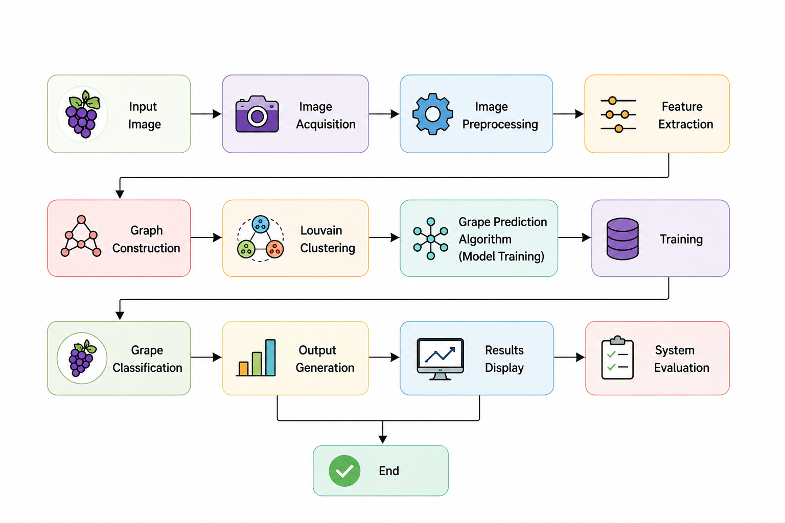

# 🍇 Optimizing Grape Quality Prediction Using Deep Learning Techniques

## 📄 Published Research Paper

This repository extends the work presented in our published IEEE conference paper by providing the complete implementation, project documentation, and desktop application.

**Title:**  
*An Enhanced Grape Quality Prediction Using Near Optimal Convolution Neural Network and Image Processing Techniques*

**Conference:**  
2025 International Conference on Data Science and Business Systems (ICDSBS)

**DOI:**  
https://doi.org/10.1109/ICDSBS63635.2025.11031647

A Graph Convolutional Network (GCN)-based grape quality prediction system that combines image processing and graph-based deep learning to classify grape quality through an interactive Tkinter desktop application.

> **Repository Note**
>
> The published IEEE paper presents the research methodology and experimental findings. This repository contains the complete implementation, including data preprocessing, feature extraction, model training scripts, GUI application, workflow, and supporting project documentation.

---

## 📖 Overview

This project presents an intelligent grape quality prediction system using **Graph Convolutional Networks (GCN)** and image processing techniques. The application analyzes grape images, extracts meaningful graph-based features, and predicts grape quality through a user-friendly **Tkinter GUI**.

The primary objective is to automate grape quality assessment, reducing manual inspection while improving consistency and efficiency in vineyards.

---

## ✨ Features

- 📷 Image preprocessing
- 🕸️ Graph construction
- 🌐 Louvain graph clustering
- 📊 Feature extraction
- 🧠 Graph Convolutional Network (GCN)
- 🖥️ Tkinter-based desktop GUI
- 🍇 Real-time grape quality prediction
- 🔊 Text-to-Speech output (optional)

---

## 🛠️ Technologies Used

| Technology | Purpose |
|------------|---------|
| Python | Programming Language |
| TensorFlow | Deep Learning |
| OpenCV | Image Processing |
| NetworkX | Graph Construction |
| NumPy | Numerical Computing |
| Pandas | Data Handling |
| Scikit-learn | Machine Learning Utilities |
| Tkinter | GUI Development |
| Pyttsx3 | Text-to-Speech |

---

## 🔄 Project Workflow

<p align="center">
  
</p>

---

## 📂 Project Structure

```text
grape-quality-prediction/
│
├── data_preparation.py
├── prepare_gnn.py
├── Nodes_Egde.py
├── Louvain_clustering.py
├── grape_feature_extraction.py
├── gnn_model.py
├── gui3 (1).py
├── README.md
├── requirements.txt
├── output_video.mp4
├── screenshots/
└── docs/
```

---

## ⚙️ Installation

Clone the repository:

```bash
git clone https://github.com/username/grape-quality-prediction.git
```

Install the required dependencies:

```bash
pip install -r requirements.txt
```

---

## ▶️ Execution Steps

Run the following scripts in sequence:

```bash
python data_preparation.py
python prepare_gnn.py
python Nodes_Egde.py
python Louvain_clustering.py
python grape_feature_extraction.py
python gnn_model.py
python "gui3 (1).py"
```

---

## 📸 Output

The application predicts grape quality from uploaded images using the trained **Graph Convolutional Network (GCN)** model.

---

## 🚀 Future Improvements

- ☁️ Cloud deployment
- 📱 Mobile application
- 📈 Higher prediction accuracy with larger datasets
- 🌱 Real-time vineyard monitoring
- 🌐 IoT sensor integration

---

## 👩‍💻 Author

**Parvatham Sneha Latha Reddy**

**B.Tech – Computer Science and Engineering**

---

## ⭐ Support

If you found this project useful, consider giving the repository a **⭐ Star**.
